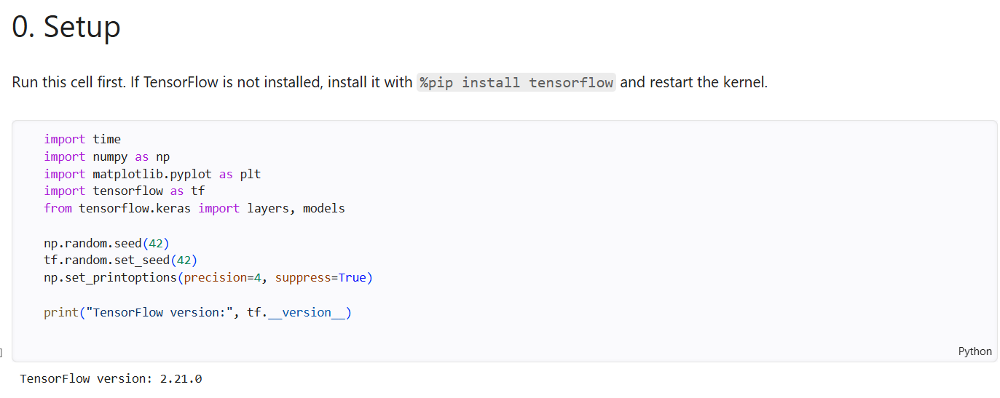
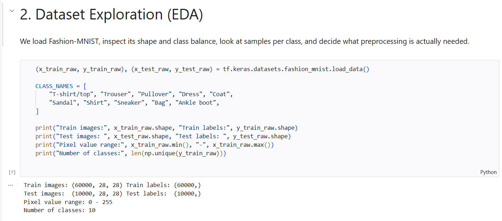
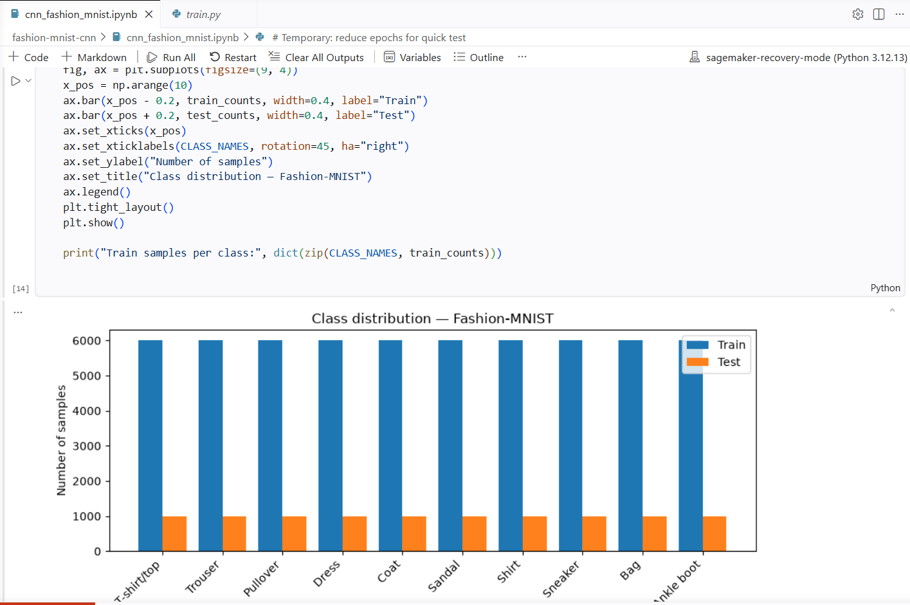
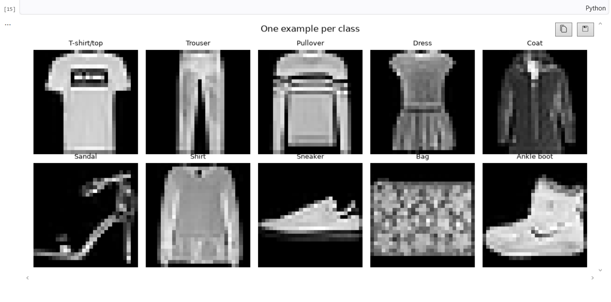
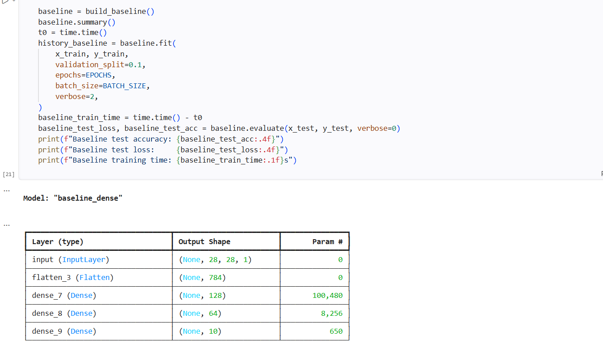

# Convolutional Neural Networks — Fashion-MNIST

## Problem Description

This assignment explores convolutional layers as an **architectural decision**
rather than a black-box recipe: they encode an inductive bias (locality +
translation invariance) directly into the model. The goal is to design,
justify, and experimentally evaluate a CNN architecture against a
non-convolutional baseline on real image data, and to reason about *why* the
architectural choice matters — not just to hit a target accuracy.

## Dataset Description

**Fashion-MNIST** (Zalando Research), loaded via `tf.keras.datasets.fashion_mnist`.

- 60,000 train / 10,000 test grayscale images, 28×28, 1 channel
- 10 balanced classes (6,000 train / 1,000 test images each): T-shirt/top,
  Trouser, Pullover, Dress, Coat, Sandal, Shirt, Sneaker, Bag, Ankle boot
- Chosen because it is image-based, grid-structured, small enough to train
  quickly, and harder than digit-MNIST (some classes — Shirt, T-shirt/top,
  Pullover, Coat — are visually close and differ mainly in local
  texture/edges), which makes the CNN-vs-dense comparison meaningful.
- See the full justification in Section 1 of the notebook.

## Architecture Diagram

```
Baseline (non-convolutional)
  Input (28,28,1)
    -> Flatten (784)
    -> Dense(128, relu)
    -> Dense(64, relu)
    -> Dense(10, softmax)
  109,386 parameters

CNN (final architecture, 3x3 kernels)
  Input (28,28,1)
    -> Conv2D(32, 3x3, stride 1, padding=same, relu)
    -> MaxPool(2x2)                              -> (14,14,32)
    -> Conv2D(64, 3x3, stride 1, padding=same, relu)
    -> MaxPool(2x2)                              -> (7,7,64)
    -> Flatten (3136)
    -> Dense(64, relu)
    -> Dropout(0.3)
    -> Dense(10, softmax)
  220,234 parameters
```

Design justification for every choice (kernel size, stride, padding, filters,
activation, pooling, regularization) is documented in Section 4 of the
notebook.

## Experimental Results

Controlled experiment: **kernel size**, 3×3 vs. 5×5, with depth, filters,
stride, padding, pooling, optimizer, batch size and epochs held fixed.

The following results were obtained locally with the real Fashion-MNIST
dataset, using one epoch and batch size 64 as a quick validation run:

| Model            | Test Accuracy | Test Loss | Parameters | Train time (s) |
|------------------|:---:|:---:|:---:|:---:|
| Baseline (Dense) | 0.8305 | 0.4816 | 109,386 | 2.4 |
| CNN (3×3)        | 0.8653 | 0.3773 | 220,234 | 7.2 |
| CNN (5×5)        | 0.8624 | 0.3793 | 253,514 | 9.7 |

The 3×3 CNN reached the best test accuracy in this quick run. The 5×5 model
used 33,280 more parameters and took longer to train, without improving
accuracy. These timings are CPU timings from a one-epoch smoke test, not a
final benchmark; use more epochs for a definitive comparison.

## Local Setup and Execution

The tested environment was Python 3.13 with TensorFlow 2.21.0. A short-path
virtual environment was used on Windows to avoid installation path-length
issues:

```powershell
C:\venv\Scripts\python -m pip install tensorflow==2.21.0 matplotlib sagemaker
C:\venv\Scripts\python -u train.py --epochs 1 --batch-size 64 --model-dir model_test
```

The command exports a TensorFlow SavedModel to `model_test/1`. The notebook
should use the `Python (cnn_venv)` kernel.

## Interpretation

Full architectural reasoning (why convolution helps, what inductive bias it
introduces, when it would *not* be appropriate) is in Section 6 of the
notebook. Summary:

- Weight sharing across spatial positions means the CNN needs to learn far
  fewer distinct patterns than the dense baseline to cover the same visual
  variability, which shows up as better accuracy-per-parameter and less
  overfitting.
- Convolution encodes **locality** (nearby pixels matter more than distant
  ones) and **translation equivariance** (a feature is recognized the same
  way regardless of where it appears) — both correct assumptions for natural
  images.
- Convolution is a poor fit for tabular/non-grid data, permutation-invariant
  sets, graph-structured data, and problems dominated by long-range
  dependencies that span the whole input (where attention-based architectures
  are usually preferred).

## SageMaker Deployment


The screenshots below document the local notebook execution and setup:







The AWS training-job and endpoint statuses must be captured after running the
SageMaker section in AWS; they cannot be validated from the local Windows
environment.


## Files

- `cnn_fashion_mnist.ipynb` — full notebook (EDA, baseline, CNN, experiment, interpretation, SageMaker deployment)
- `train.py` — SageMaker script-mode training entry point (also embedded via `%%writefile` in the notebook)
- `README.md` — this file
